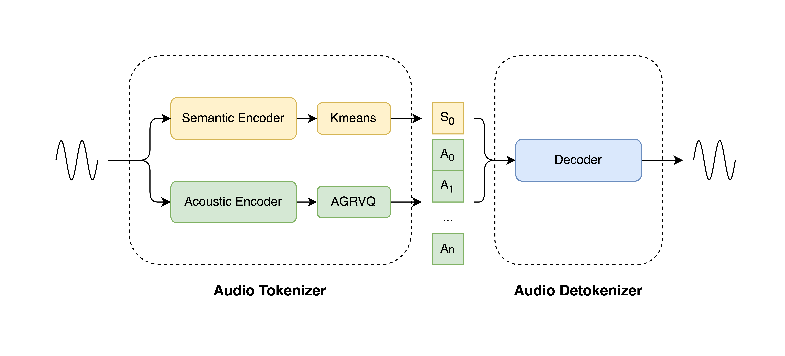

<div align="center">
  
</div>

<div align="center" style="line-height: 1;">
  <h1 style="text-align: center; margin: 0;">LongCat-Audio-Codec: An Audio Tokenizer and Detokenizer Solution Designed for Speech Large Language Models</h1>
</div>
<br>

<div align="center" style="line-height: 1;">
  <a href="tech_report.pdf" target="_blank" style="margin: 2px;">
    
  </a>
  
  <a href="https://huggingface.co/meituan-longcat/LongCat-Audio-Codec" target="_blank" style="margin: 2px;">
    
  </a>
</div>

<div align="center" style="line-height: 1;">
  <a href="https://github.com/meituan-longcat/LongCat-Audio-Codec/blob/main/images/Wechat.png" target="_blank" style="margin: 2px;">
    
  </a>
  <a href="https://x.com/Meituan_LongCat" target="_blank" style="margin: 2px;">
    
  </a>
</div>

<div align="center" style="line-height: 1;">
  <a href="LICENSE" style="margin: 2px;">
    
  </a>
</div>


LongCat-Audio-Codec is an audio tokenizer and detokenizer solution designed for speech large language models. It works by generating semantic and acoustic tokens in parallel, enabling high-fidelity audio reconstruction at extremely low bitrates with excellent backend support for Speech LLM.

<div align="center">
  
</div>

## ✨ Key Features

- **High Fidelity at Ultra-Low Bitrates:** As a codec, it achieves high-intelligibility audio reconstruction at extremely low bitrates.
- **Low-Frame-Rate Tokenizer:** As a tokenizer,it extracting semantic tokens and acoustic tokens in parallel at a low frame rate of 16.6Hz, with flexible acoustic codebook configurations to adapt to different downstream tasks.
- **Low-Latency Streaming Detokenizer:** Equipped with a specially designed streaming-capable detokenizer that requires minimal future information to deliver high-quality audio output with low latency.
- **Super-Resolution Capability:** Integrates audio super-resolution processing into the detokenizer, enabling the generation of high-quality audio with a higher sample rate than the original input.

## 🚀Quick Start

### 🛠️Installation

#### 1. Create a conda environment and install pytorch

**Note:** The torch version listed in below is just an example. Please install the version of PyTorch that matches your specific hardware configuration

```
conda create -n LongCat-Audio-Codec python=3.10
conda activate LongCat-Audio-Codec
pip install torch==2.7.1 torchaudio==2.7.1
```

#### 2. Other dependencies:

```
pip install -r requirements.txt
```

### 📦Model Preparation

#### 1. Model Download

| Models                        | Download Link                                                | Notes                                                        |
| ----------------------------- | ------------------------------------------------------------ | ------------------------------------------------------------ |
| LongCatAudioCodec_encoder               | 🤗 [Huggingface](https://huggingface.co/meituan-longcat/LongCat-Audio-Codec/resolve/main/ckpts/LongCatAudioCodec_encoder.pt) | encoder weights with semantic encoder and acoustic encoder |
| LongCatAudioCodec_encoder_cmvn          | 🤗 [Huggingface](https://huggingface.co/meituan-longcat/LongCat-Audio-Codec/blob/main/ckpts/LongCatAudioCodec_encoder_cmvn.npy) | coefficients of Cepstral Mean and Variance Normalization, used by semantic encoder |
| LongCatAudioCodec_decoder16k_4codebooks | 🤗 [Huggingface](https://huggingface.co/meituan-longcat/LongCat-Audio-Codec/resolve/main/ckpts/LongCatAudioCodec_decoder_16k_4codebooks.pt) | 16k decoder, supply 1 semantic codebook and at most 3 acoustic codebooks |
| LongCatAudioCodec_decoder24k_2codebooks | 🤗 [Huggingface](https://huggingface.co/meituan-longcat/LongCat-Audio-Codec/resolve/main/ckpts/LongCatAudioCodec_decoder_24k_2codebooks.pt) | 24k decoder, supply 1 semantic codebook and 1 acoustic codebook, SFT on limited speakers |
| LongCatAudioCodec_decoder24k_4codebooks | 🤗 [Huggingface](https://huggingface.co/meituan-longcat/LongCat-Audio-Codec/resolve/main/ckpts/LongCatAudioCodec_decoder_24k_4codebooks.pt) | 24k decoder, supply 1 semantic codebook and at most 3 acoustic codebooks |


#### 2. Link LongCat-Audio-Codec Model to Right Path

After downloading the model checkpoint files (.pt files), you have two options for making them accessible to the inference script:

**Option 1: Place Models in the Default ckpts Directory (Recommended)**

For a quick setup,all models and configuration files must be placed within the LongCat-Audio-Codec/  project root directory.

The final, correct project structure should look exactly like this:

```
LongCat-Audio-Codec/			 <-- Project Root
├── ckpts/
│   ├── LongCatAudioCodec_decoder_16k_4codebooks.pt
│   ├── LongCatAudioCodec_decoder_24k_2codebooks.pt
│   ├── LongCatAudioCodec_decoder_24k_4codebooks.pt
│   ├── LongCatAudioCodec_encoder.pt
|   └── LongCatAudioCodec_encoder_cmvn.npy
├── configs/
│   ├── LongCatAudioCodec_decoder_16k_4codebooks.yaml
│   ├── LongCatAudioCodec_decoder_24k_2codebooks.yaml
│   ├── LongCatAudioCodec_decoder_24k_4codebooks.yaml
│   └── LongCatAudioCodec_encoder.yaml
├── inference.py
└── run_inference.sh
└── ... (e.g., README.md, .git folder)
```

**Option 2: Modify Configuration Files (.yaml) to Point to Custom Paths**

If you prefer to store your models in a different location, you must update their paths in the corresponding .yaml configuration files. This is a more advanced option for users who want full control over their file structure.

You will need to edit files in two main locations to relocate LongCat-Audio-Codec model:

- To relocate a **LongCat-Audio-Codec model**, change `configs/LongCatAudioCodec_xxx.yaml` like this:

  ```
  # Original:
  ckpt_path: 'ckpts/LongCatAudioCodec_decoder_24k_2codebooks.pt'
  # Modified:
  ckpt_path: '/path/to/my/models/LongCatAudioCodec_decoder_24k_2codebooks.pt'
  ```

### **🎮 Run the Demo**

This project includes a convenient script to demonstrate the core functionalities of LongCat-Audio-Codec.

#### 1. One-Click Execution

For a quick start, simply run the provided shell script from the project's root directory. This will process a predefined list of audio files from the demos/org folder and save the reconstructed outputs.

```
bash ./run_inference.sh
```

After execution, you will find the reconstructed audio files in the demo_audio_output/ directory.

#### 2. How It Works

The run_inference.sh script automates the process of calling the main Python script, inference.py. It demonstrates two key features:

- **Demo 1: Multi-rate Synthesis**
  - The script first encodes each input audio file into a single set of semantic and acoustic tokens.
  - It then uses two different decoders (16k and 24k) to reconstruct the audio from these same tokens, showcasing the model's multi-rate capabilities.
  - The output files will be named like ..._reconstructed_16k.wav and ..._reconstructed_24k.wav.
- **Demo 2: Batch Token Extraction API**
  - The script also demonstrates how to use the encoder's API to extract semantic and acoustic tokens for a batch of audio files, which is useful for more advanced applications in backends such as Speech LLM.

#### 3. Customization

You can easily customize the demo by modifying the run_inference.sh script or by running inference.py directly with your own arguments.

**a) Modifying the Script (run_inference.sh)**

Open run_inference.sh in a text editor to change the default behavior:

- **To process your own audio files:**
  Modify the AUDIO_FILES variable to include the paths to your files.

  ```
  AUDIO_FILES="path/to/your/audio1.wav \
               path/to/your/audio2.wav"
  ```

- **To change the number of acoustic codebooks:**
  Adjust the `N_ACOUSTIC_CODEBOOKS` variable. This controls the trade-off between quality and bitrate (higher numbers generally mean better quality). Note that the total number of codebooks used is `N_ACOUSTIC_CODEBOOKS + 1` (one semantic codebook is always used).

  ```
  # Use 2 acoustic codebooks (3 total)
  N_ACOUSTIC_CODEBOOKS=2
  ```

**b) Running inference.py Directly**

For full control, you can call inference.py with your own arguments. Use --help to see all available options.

```
python inference.py --help
```

**Example of a custom run:**

```
python inference.py \
    --encoder_config "configs/LongCatAudioCodec_encoder.yaml" \
    --decoder16k_config "configs/LongCatAudioCodec_decoder_16k_4codebooks.yaml" \
    --decoder24k_config "configs/LongCatAudioCodec_decoder_24k_4codebooks.yaml" \
    --output_dir "my_custom_output" \
    --n_acoustic_codebooks 3 \
    --audio_files "path/to/my.wav"
```

*(Note: When running inference.py directly, you must provide all required arguments, such as configs and input files.)*

## 🎵 Demos

We provide a variety of audio samples to demonstrate the performance of LongCat-Audio-Codec across different emotions and scenarios. In the demos folder:
1. The audio files in the rebuilt_24k_4codebooks subfolder are reconstructed using a 24kHz Decoder with 4 codebooks. This decoder is trained on a large-scale speaker dataset, can be used as a universal high-quality decoder.
2. The audio files in the rebuilt_24k_2codebooks subfolder are reconstructed using a 24kHz Decoder with 2 codebooks. This decoder is fine-tuned on a limited speaker dataset, and is used to demonstrate the decoder’s ability to achieve high-quality reconstruction at extremely low bitrates.

## 🔥 Latest News
* Oct 20, 2025: We release the [arxiv page](https://arxiv.org/abs/2510.15227) of  **LongCat-Audio-Codec**
* Oct 17, 2025: We release the [project page](https://github.com/meituan-longcat/LongCat-Audio-Codec/) of  **LongCat-Audio-Codec**


## ❗ Limitations & Known Issues

1. The current version of LongCat-Audio-Codec only supports single-channel speech.
2. The input audio length must be less than 30 seconds. If the input audio is longer than 30 seconds, the user must split it into segments no longer than 30 seconds.
3. The LongCatAudioCodec_decoder_24k_2codebooks.pt has been SFT on limited speakers. Thus, the quality of the reconstructed audio may be degraded when the input audio is from a speaker not included in the training set.


## 📚 Citation

If you find our work useful in your research, please consider citing:

```
@article{longcataudiocodec,
  title={LongCat-Audio-Codec: An Audio Tokenizer and Detokenizer Solution Designed for Speech Large Language Models},
  author={Xiaohan Zhao, Hongyu Xiang, Shengze Ye, Song Li, Zhengkun Tian, Guanyu Chen, Ke Ding, Guanglu Wan},
  journal={arXiv preprint arXiv:2510.15227},
  organization={LongCat Team, Meituan},
  year={2025}
}
```

## 📜 License

The code and models in this repository are released under the **MIT License**. This grants you broad permissions to use, copy, modify, and distribute the software, provided you include the original copyright notice. We claim no ownership over any content you generate using these models.

The software is provided "AS IS", without any warranty. You are fully accountable for your use of the models. Your usage must not involve creating or sharing any content that violates applicable laws, causes harm to individuals, disseminates personal information with harmful intent, spreads misinformation, or targets vulnerable groups.


## 📩 Contact
Please contact us at <a href="mailto:longcat-team@meituan.com">longcat-team@meituan.com</a> or join our WeChat Group if you have any questions.

#### WeChat Group
